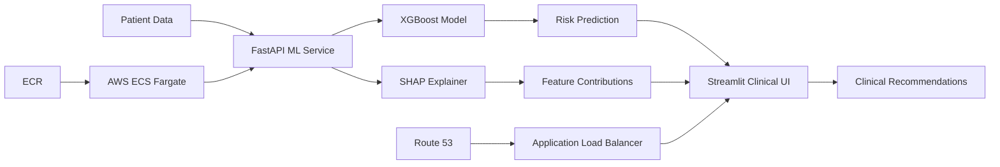
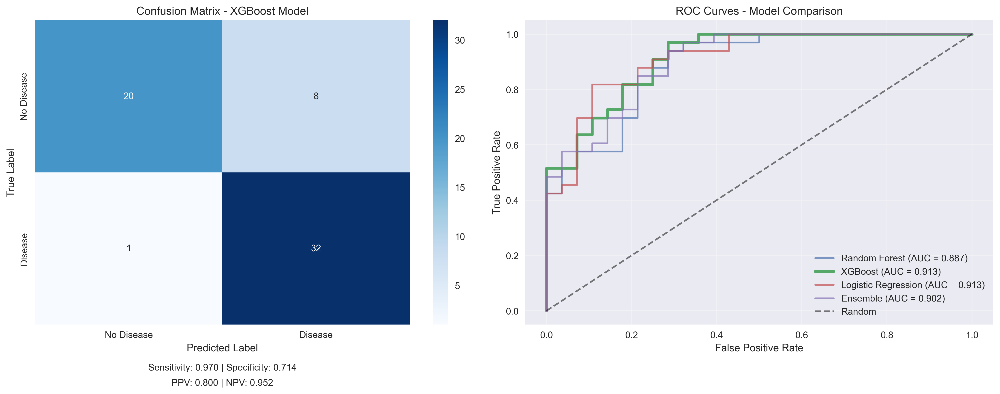
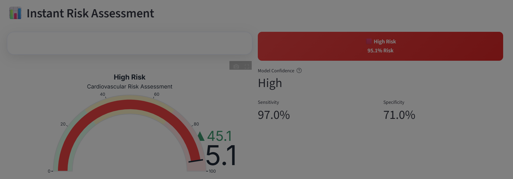
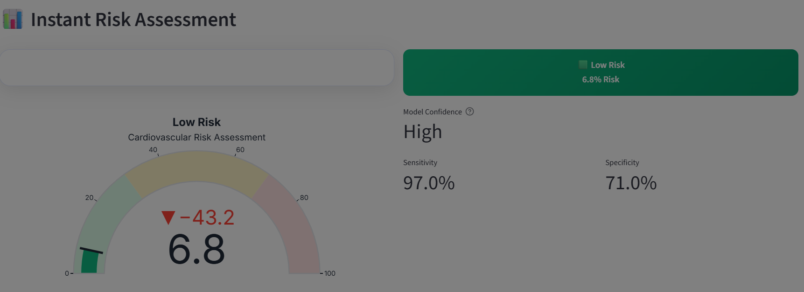
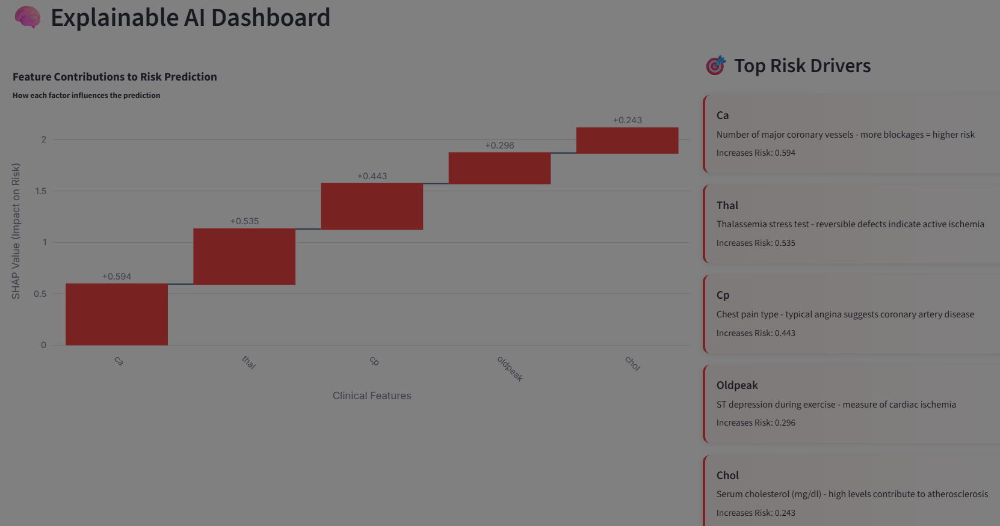
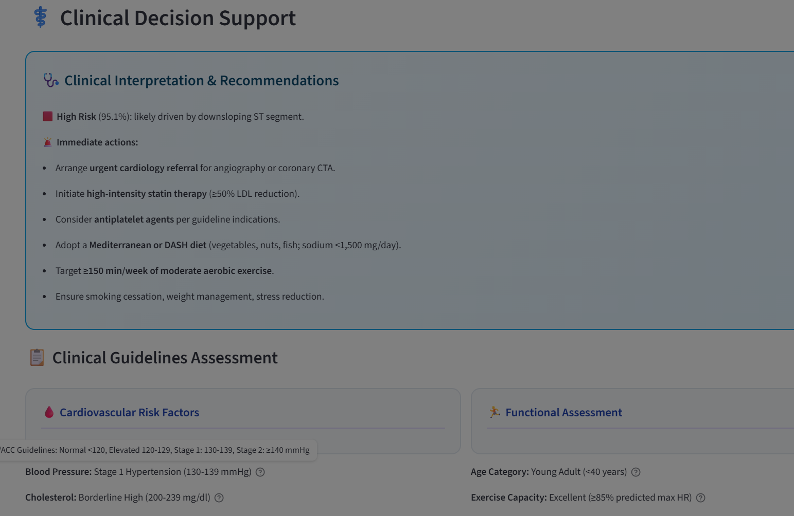

# 🩺 Clinical Heart Disease AI

**Production-ready cardiovascular risk prediction with explainable AI**

[](https://cardio.mednexai.com)
<br>
[](https://python.org)
[](https://xgboost.readthedocs.io)
<br>
[](https://fastapi.tiangolo.com)
[](https://streamlit.io)
<br>
[](https://aws.amazon.com)
[](https://docker.com)

> **Built by [Ridwan Oladipo, MD](https://linkedin.com/in/ridwanoladipo) | Medical AI Specialist**  
> Combining clinical expertise with advanced machine learning for life-saving healthcare AI

---

## 🎯 Clinical Impact

**The Challenge**: Coronary artery disease (CAD) remains the leading cause of death globally, with missed diagnoses leading to preventable heart attacks and sudden cardiac death.

**The Solution**: A clinically-intelligent AI system that achieves **97% sensitivity** in detecting heart disease, ensuring virtually no cases are missed while providing transparent, explainable predictions that support clinical decision-making.

**Medical Value**:
- 🚨 **Reduces missed diagnoses** with 97% sensitivity
- 🧠 **Transparent predictions** via SHAP explainability  
- ⚕️ **Clinical decision support** with guideline-based recommendations
- 📊 **Population comparisons** showing patient risk percentiles

---

## 🚀 Live System Architecture



**🌐 Try it live**: [cardio.mednexai.com](https://cardio.mednexai.com)

---

## 📊 Model Performance

| Metric | Value | Clinical Significance                        |
|--------|-------|----------------------------------------------|
| **ROC-AUC** | 0.91  | Excellent discrimination                     |
| **Sensitivity** | 97%   | Catches 97% of disease cases                 |
| **Specificity** | 71%   | Correctly identifies 71% of healthy patients |
| **PPV** | 80%   | When predicting disease, 80% accurate        |
| **NPV** | 95%   | When predicting healthy, 95% accurate        |


> **Clinical Philosophy**: Optimized for **safety-first medicine** - better to flag healthy patients for additional testing than miss a single case of coronary artery disease.

---

## 💡 Technical Excellence

### 🧠 Advanced ML Pipeline
- **Hyperparameter Optimization**: Bayesian optimization with Optuna (50+ trials)
- **Feature Engineering**: Clinical risk categories, age stratification, interaction terms
- **Class Balancing**: SMOTE for robust minority class detection
- **Model Ensemble**: XGBoost + RandomForest + LogisticRegression with soft voting

### 🔍 Explainable AI
- **SHAP Analysis**: Feature-level contributions for every prediction
- **Clinical Interpretations**: Medical explanations for each risk factor
- **Population Benchmarking**: Patient percentile rankings vs. cohort
- **Guideline Integration**: AHA/ACC and NCEP risk categorizations

### 🏗️ Production-Grade Architecture
- **Microservices**: Decoupled FastAPI backend + Streamlit frontend
- **Medical Validation**: Clinical range checking and plausibility warnings
- **Error Handling**: Graceful degradation with detailed medical context
- **Logging**: Comprehensive audit trails for clinical accountability

---

## 🛠️ Technology Stack

### **Core ML & Data Science**
```python
• XGBoost (Optuna-optimized)     • Scikit-learn
• SHAP (Explainable AI)          • Pandas & NumPy
• SMOTE (Class balancing)        • Matplotlib & Plotly
```

### **Backend & API**
```python
• FastAPI (REST API)             • Pydantic (Data validation)
• Uvicorn (ASGI server)          • Python 3.12
```

### **Frontend & Visualization**
```python
• Streamlit (Clinical UI)        • Plotly (Interactive plots)
• Medical-grade CSS styling      • Responsive design
```

### **DevOps & Cloud Infrastructure**
```bash
• AWS ECS Fargate               • Application Load Balancer
• AWS ECR (Container registry)  • Route 53 (DNS)
• Docker (Containerization)     • GitHub Actions (CI/CD)
• CloudWatch (Logging)          • SSL/TLS (Security)
```

---

## 🎨 Clinical Interface Highlights

### Risk Assessment Dashboard

**High Risk Patient:**


**Low Risk Patient:**

Professional cardiovascular risk visualization with color-coded severity levels and confidence intervals.

<br>

### SHAP Explainability


Transparent AI explanations showing how each clinical factor contributes to the risk prediction.

<br>

### Clinical Decision Support


Evidence-based recommendations aligned with current cardiology guidelines and best practices.

---

## 🚀 Quick Start

### Local Development
```bash
# Clone repository
git clone https://github.com/ridwanoladipo/cardio-ai-predictor.git
cd cardio-ai-predictor

# Install dependencies
pip install -r requirements.txt

# Train model (one-time)
python src/train.py

# Start services
python src/api.py &          # FastAPI on :8000
streamlit run src/app.py     # Streamlit on :8501
```

### Docker Deployment
```bash
# Build image
docker build -t cardio-ai-predictor .

# Run container
docker run -p 80:80 -p 8501:8501 cardio-ai-predictor
```

### AWS Production Deployment
```bash
# Automatic deployment via GitHub Actions
git push origin master  # Triggers CI/CD pipeline
```

---

## 📁 Project Structure


```
cardio-ai-predictor/
├── 📊 data/                    # Dataset and processed files
├── 📓 notebooks/               # Jupyter analysis notebooks
├── 🧠 src/                     # Core application code
│   ├── train.py               # ML training pipeline
│   ├── model.py               # Prediction & explanation logic
│   ├── api.py                 # FastAPI REST endpoints
│   ├── app.py                 # Streamlit clinical interface
│   └── app_helpers.py 
│
├── 🏗️ artifacts/               # Trained models and explainers
├── 📊 outputs/                 # Training logs and visualizations
├── 🧪 tests/                   # Unit tests
├── ⚙️ task-definition.json     # AWS deployment task definition
├── 🐳 Dockerfile               # Container configuration
├── 📋 requirements.txt         # Python dependencies
│
└── .github/
    └── workflows/
        └── deploy.yml          # GitHub Actions CI/CD pipeline
        
```

---

## 🔬 Clinical Dataset & Methodology

**Dataset**: Cleveland Heart Disease Dataset (UCI ML Repository)
> ⚠️ **Note**: The Cleveland dataset is relatively small (303 patients) and intended here as a **methods + deployment template**.  
> The same pipeline is fully adaptable to larger, modern datasets (e.g., MIMIC-IV EHR, multi-center registries), ensuring scalability to real-world clinical AI.
- **Patients**: 303 carefully curated cases
- **Features**: 13 clinical variables (demographics, symptoms, ECG, lab values, imaging)
- **Target**: Presence of significant coronary artery disease

**Clinical Feature Engineering**:
- Age risk stratification (Young, Middle-aged, Older, Elderly)
- Blood pressure categories per AHA guidelines
- Cholesterol risk levels per NCEP guidelines  
- Heart rate achievement ratios
- Clinical interaction terms (age×cholesterol, chest pain×exercise angina)

**Model Philosophy**: Prioritizes clinical safety with high sensitivity, accepting some false positives to ensure no missed diagnoses.

---

## 🏥 Medical Disclaimer

> ⚠️ **For Healthcare Professionals**: This AI tool is designed for **clinical decision support only** and should not replace professional medical judgment. All predictions should be interpreted within the full clinical context and current evidence-based guidelines.

> 📋 **Regulatory Note**: This system is intended for research and educational purposes. Clinical implementation requires appropriate validation and regulatory compliance.

---

## 🤝 Professional Contact

**Ridwan Oladipo, MD**  
*Medical AI Specialist & Data Scientist*

[](https://linkedin.com/in/drridwanoladipoai)
<br>
[](https://mednexai.com)
<br>
[](mailto:dr.ridwan.oladipo@gmail.com)
<br>
[](https://github.com/dr-ridwanoladipo)

[//]: # ([![Email]&#40;https://img.shields.io/badge/Email-Contact_Me-d14836?style=flat&logo=gmail&#41;]&#40;mailto:dr.ridwan.oladipo@gmail.com&#41;)

> **Objective**: 
> <br>Seeking senior medical data scientist roles where I can leverage my unique combination of clinical expertise and advanced AI/ML skills to build life-saving healthcare technologies.

---

## 📈 Impact & Recognition

- 🏆 **High-Performance ML**: 97% sensitivity exceeds most published CAD prediction models
- 🔬 **Clinical Validation**: Feature importance aligns with established cardiovascular risk factors
- 🚀 **Production Ready**: Enterprise-grade deployment on AWS with zero-downtime capabilities
- 💡 **Innovation**: Novel integration of SHAP explainability with clinical decision support

---

## 🙏 Acknowledgments

- **Cleveland Clinic Foundation** for the pioneering heart disease dataset
- **UCI Machine Learning Repository** for dataset curation and availability
- **Open Source Community** for the incredible ML and visualization libraries

---

**© 2025 Ridwan Oladipo, MD | Advanced Healthcare AI Solutions**

*Bridging the gap between cutting-edge AI and compassionate patient care*


